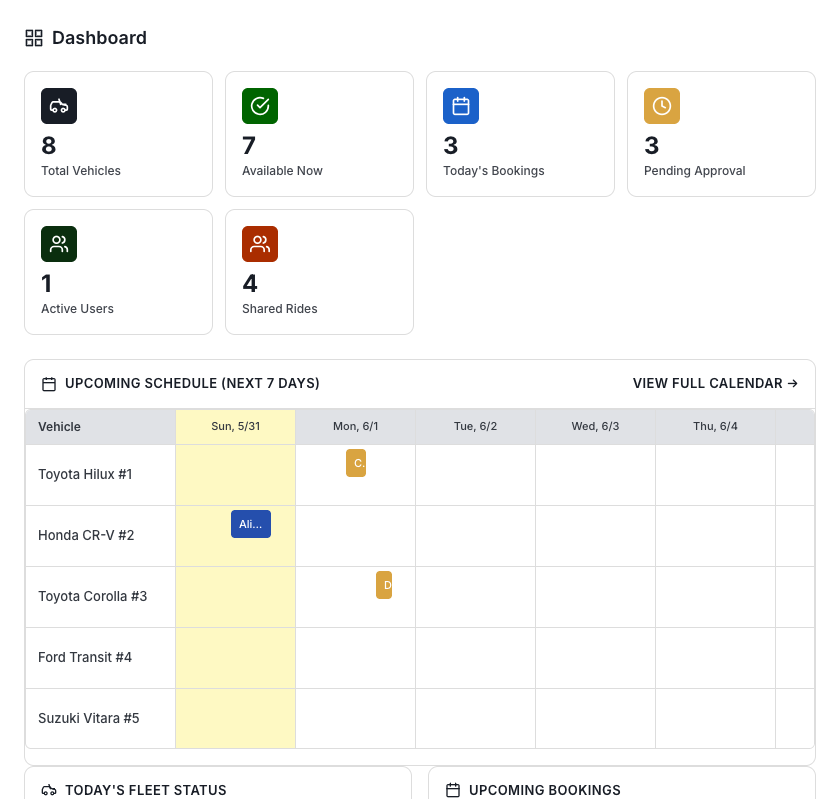
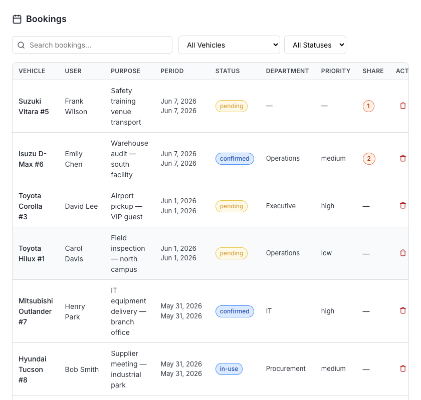
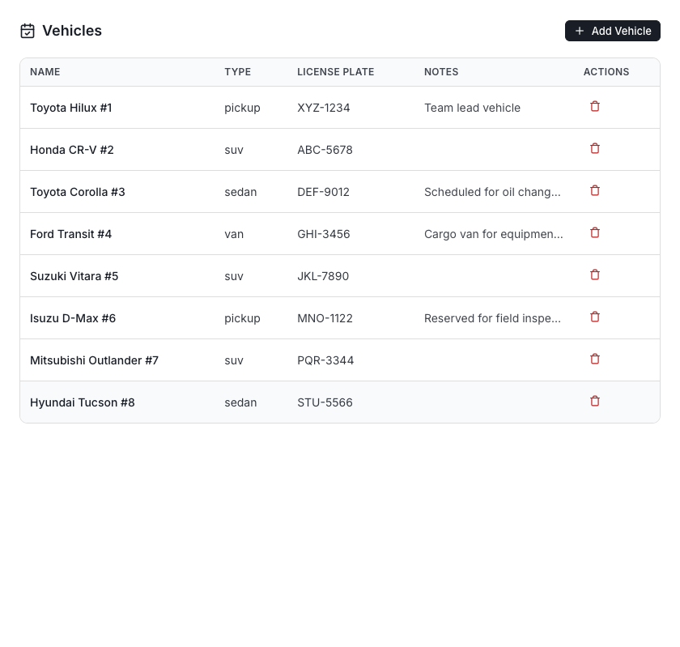
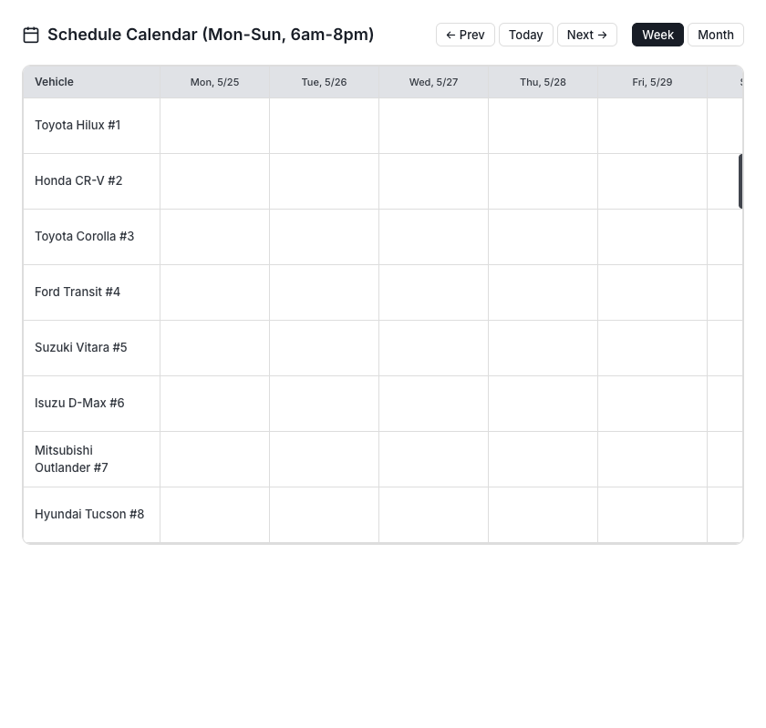
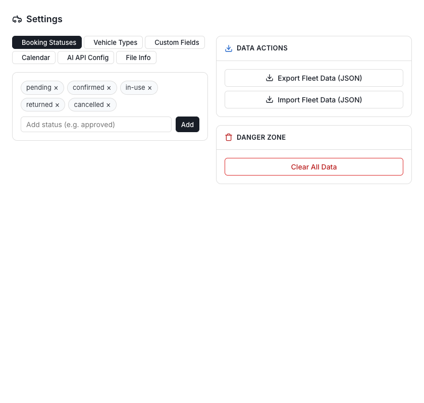

# FleetHub — Local File Mode

**Zero-backend fleet management.** A single HTML file that stores data in a local SQLite database. No server, no login, no cloud services required.

**Live demo:** [cj-1981.github.io/fleethub-local](https://cj-1981.github.io/fleethub-local/)


## Features

- **Single HTML file** — No build step, no server-side dependencies, no installation
- **SQLite database** — Data stored in a `.sqlite` file using [sql.js](https://sql.js.org/) (WebAssembly SQLite compiled to run in-browser)
- **JSON import/export** — Seamless migration from legacy JSON format with full data preservation
- **Airtable-inspired UI** — Clean, professional, hairline borders, subtle surfaces
- **No login required** — Open the file and start managing your fleet
- **File locking** — Prevents concurrent editing conflicts across tabs and users
- **OneDrive compatible** — Open `.sqlite` files from your synced OneDrive folder
- **GitHub Pages ready** — Host the HTML file; data stays local in the browser
- **AI Assistant** — Built-in fleet chat with OpenAI-compatible function calling (create bookings, update vehicle status, cancel bookings, list fleet data)
- **Markdown rendering** — AI chat responses rendered with full Markdown support via [marked.js](https://marked.js.org/)
- **Keyboard shortcuts** — `Ctrl+S` to save, `Ctrl+N` for new booking
- **Calendar View** — Gantt chart-style calendar showing vehicle schedules across time with holiday highlighting (German states)
- **Custom Fields** — Multi-select fields, editable field definitions for bookings
- **Click-to-Edit** — Click any booking or vehicle row to edit
- **Auto-archive** — Configurable automatic archiving of old bookings with retention settings
- **Search & Filter** — Find bookings by ID, name, purpose, or any field; filter by vehicle and status
- **Pagination** — Bookings table with configurable page size

## Quick Start

1. **Open `index.html`** in Chrome, Edge, or Opera
2. Click **"Open Fleet Data"** and select your `.sqlite` or `.json` file
3. Or click **"Create New File"** to start fresh with a new `.sqlite` database
4. Or click **"Try Demo"** to explore with pre-populated sample data

> The File System Access API (used for read/write) is supported in Chromium-based browsers. Firefox/Safari users can still use Import/Export.

## OneDrive Team Workflow

1. Place your `.sqlite` file in a shared OneDrive folder
2. Each team member opens `index.html` (locally or from GitHub Pages)
3. Click **"Open Fleet Data"** and navigate to the OneDrive synced folder
4. The first user to open the file acquires a **lock**
5. Subsequent users see a **lock warning** with option to take over
6. Save with `Ctrl+S` or the Save button — changes sync via OneDrive

## File Locking

- **Automatic lock** when first user opens the file
- **Lock alert** shown to subsequent users with the locker's ID and elapsed time
- **Stale lock detection** — locks older than 5 minutes can be taken over
- **BroadcastChannel** — cross-tab lock detection in the same browser
- **Session-based lock ID** — each browser session generates a unique lock identifier
- **Auto-release** — lock is released when the tab is closed

## Database Schema

FleetHub uses SQLite via [sql.js](https://sql.js.org/) (WebAssembly). Data is stored in four tables:

### `meta`

| Column | Type | Description |
|--------|------|-------------|
| `key` | TEXT PK | Metadata key |
| `value` | TEXT | Metadata value |

Stores version, timestamps, lock state (`lockedBy`, `lockedAt`, `lockId`, `lastModified`).

### `vehicles`

| Column | Type | Description |
|--------|------|-------------|
| `id` | TEXT PK | Unique ID (generated) |
| `name` | TEXT | Vehicle name |
| `type` | TEXT | Vehicle type (sedan, suv, pickup, van, bus, motorcycle, other) |
| `license_plate` | TEXT | License plate number |
| `status` | TEXT | Status (available, in-use, maintenance, reserved) |
| `notes` | TEXT | Optional notes |
| `sort_order` | INTEGER | Display ordering |
| `created_at` | TEXT | ISO timestamp |
| `updated_at` | TEXT | ISO timestamp |

### `bookings`

| Column | Type | Description |
|--------|------|-------------|
| `id` | TEXT PK | Unique ID (generated) |
| `vehicle_id` | TEXT FK | Reference to `vehicles.id` |
| `period_start` | TEXT | ISO datetime |
| `period_end` | TEXT | ISO datetime |
| `user_name` | TEXT | Booking user |
| `purpose` | TEXT | Booking purpose |
| `status` | TEXT | Status (configurable, default: pending, confirmed, in-use, returned, cancelled) |
| `remarks` | TEXT | Optional remarks |
| `custom_fields` | TEXT | JSON object for custom field values |
| `share_with` | TEXT | JSON array of co-passenger names |
| `share_note` | TEXT | Carpool message |
| `created_at` | TEXT | ISO timestamp |
| `updated_at` | TEXT | ISO timestamp |

### `settings`

| Column | Type | Description |
|--------|------|-------------|
| `key` | TEXT PK | Setting key |
| `value` | TEXT | JSON-encoded value |

Stores: `statuses` (booking status enum), `vehicleTypes` (vehicle type enum), `customColumns` (custom field definitions), `shareMessage`, `germanState` (for holiday calendar), `userNameConfig`, `archiveEnabled`, `archiveRetentionMonths`.

### `archived_bookings`

Same schema as `bookings` plus `vehicle_name` (denormalized), `archived_at`, and `archive_year`. Old bookings are automatically moved here based on retention settings.

## Legacy JSON Format

FleetHub can import data from the legacy JSON format for seamless migration. The JSON schema:

```jsonc
{
  "meta": {
    "version": "1.0",
    "lastModified": "ISO timestamp"
  },
  "vehicles": [
    {
      "id": "unique-id",
      "name": "Vehicle Name",
      "type": "sedan|suv|pickup|van|bus|motorcycle|other",
      "licensePlate": "ABC-1234",
      "status": "available|in-use|maintenance|reserved",
      "notes": "Optional notes",
      "sortOrder": 0,
      "createdAt": "ISO timestamp",
      "updatedAt": "ISO timestamp"
    }
  ],
  "bookings": [
    {
      "id": "unique-id",
      "vehicleId": "vehicle-id",
      "userName": "Name",
      "purpose": "Purpose",
      "periodStart": "ISO datetime",
      "periodEnd": "ISO datetime",
      "status": "pending|confirmed|in-use|returned|cancelled",
      "remarks": "Optional",
      "customFields": {
        "text_field": "value",
        "multiselect_field": ["value1", "value2"]
      },
      "shareWith": ["Co-passenger names"],
      "shareNote": "Optional message",
      "createdAt": "ISO timestamp",
      "updatedAt": "ISO timestamp"
    }
  ],
  "settings": {
    "statuses": ["pending", "confirmed", "in-use", "returned", "cancelled"],
    "vehicleTypes": ["sedan", "suv", "pickup", "van", "bus", "motorcycle", "other"],
    "customColumns": [
      {
        "id": "unique-id",
        "key": "department",
        "label": "Department",
        "type": "text|number|date|select|multiselect",
        "options": ["opt1", "opt2"]
      }
    ],
    "shareMessage": "Default carpool message"
  }
}
```

## Hosting on GitHub Pages

1. Push this repo to GitHub
2. Go to **Settings → Pages**
3. Set source to the `main` branch
4. Your app will be available at [cj-1981.github.io/fleethub-local](https://cj-1981.github.io/fleethub-local/)

> Note: File System Access API requires a **secure context** (HTTPS or localhost). GitHub Pages serves over HTTPS, so it works.

## AI Assistant

The built-in AI assistant works in two modes:

1. **Local mode** (default) — Responds with fleet data summaries (available vehicles, pending bookings, etc.)
2. **API mode** — Connect any OpenAI-compatible API endpoint for intelligent responses with function calling

### AI Tools (API Mode)

When connected to an API, the assistant can take actions using five tools:

| Tool | Description |
|------|-------------|
| `create_booking` | Create a new vehicle booking (requires vehicleName, userName, purpose, periodStart, periodEnd) |
| `update_vehicle_status` | Change a vehicle's status (available, in-use, maintenance, reserved) |
| `cancel_booking` | Cancel a booking by its ID |
| `list_vehicles` | List all vehicles with their current status |
| `list_bookings` | List bookings, optionally filtered by status |

Status enums are dynamically loaded from your settings, so custom statuses work automatically.

### Configuration

To configure API mode, open browser console and run:

```javascript
localStorage.setItem('fleethub_ai_endpoint', 'https://api.openai.com/v1/chat/completions');
localStorage.setItem('fleethub_ai_key', 'your-api-key');
localStorage.setItem('fleethub_ai_model', 'gpt-4o-mini');
```

The endpoint URL will be automatically normalized — you can provide either the base URL or the full `/chat/completions` path.

## Calendar View

The Calendar tab provides a Gantt chart-style visualization of your fleet schedule:

- **Vehicle rows** — Each vehicle appears as a horizontal lane
- **Time-based columns** — View bookings across days (week view: 7 days, month view: 30 days)
- **Color-coded bars** — Booking bars are colored by status (pending=mustard, confirmed=blue, in-use=green, returned=gray, cancelled=red)
- **Holiday highlighting** — German nationwide and state-specific holidays (configurable state in settings)
- **Interactive** — Hover for details (user, purpose, date range), click to edit
- **Navigation** — Previous/Next buttons to navigate through time, "Today" button to jump to current date
- **Dashboard widget** — Compact 3-day view on the dashboard for quick reference

## Custom Fields

Custom fields extend booking data with your organization's specific needs:

### Field Types
- **Text** — Free-form text input
- **Number** — Numeric values
- **Date** — Date picker
- **Select** — Single value from dropdown
- **Multi-select** — Multiple values as checkboxes

### Managing Custom Fields
1. Go to **Settings → Custom Fields**
2. Fill in **Label** (display name) and **Key** (field identifier)
3. Select **Type** and provide options (for select/multiselect)
4. Click **Add Field**
5. Fields can be edited or deleted anytime

### Usage
- Custom fields appear in booking create/edit forms
- Multi-select values display as comma-separated lists in the bookings table
- Field definitions are editable — click the edit icon to modify label, type, or options
- Perfect for tracking: departments, priorities, cost centers, project codes, etc.

## Auto-Archiving

FleetHub can automatically archive old bookings to keep your active data clean:

1. Go to **Settings → Data Management → Archive Settings**
2. Toggle **Auto-archive enabled** on/off
3. Set **Retention period** (in months) — bookings whose `period_end` is older will be archived
4. View archived bookings in the Archive section with year-based browsing
5. Archived bookings are stored in a separate table and excluded from active views

## Screenshots

### Dashboard


Dashboard with fleet statistics, status overview, and compact calendar widget

### Bookings


Booking management with search, filters, pagination, and conflict detection

### Vehicles


Vehicle management with CRUD operations and status tracking

### Calendar


Gantt chart-style calendar showing vehicle schedules across time

### Settings


Settings panel for customizing statuses, types, custom fields, and data management

## Technology

| Component | Technology |
|-----------|-----------|
| Database | [sql.js](https://sql.js.org/) v1.12.0 (SQLite compiled to WebAssembly) |
| Markdown | [marked.js](https://marked.js.org/) (CDN) |
| Styling | Inline CSS with custom properties |
| File I/O | File System Access API (Chromium browsers) |
| Cross-tab sync | BroadcastChannel API |
| Icons | Inline SVG |
| Fonts | [Inter](https://fonts.google.com/specimen/Inter) (Google Fonts) |

## Browser Compatibility

- **Full support**: Chrome, Edge, Opera (File System Access API + WebAssembly)
- **Limited support**: Firefox, Safari — can use Import/Export for file operations; no direct read/write
- **Requirement**: Secure context (HTTPS or localhost)

## License

MIT
